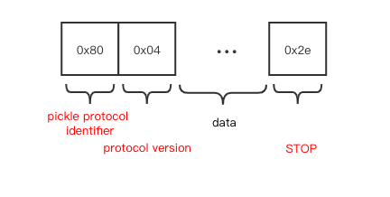

# Pickle

# contents

* [related file](#related-file)
* [introduction](#introduction)
* [implementation](#implementation)
* [read more](#read-more)

# related file

* Lib/pickle.py
* Modules/_pickle.c
* Modules/clinic/_pickle.c.h

# introduction

The `pickle` module will use the faster  `_pickle` implemented in `C`(`Modules/_pickle.c`)  if possible, if the `_pickle` module not found, the `python` implemented `pickle`(`Lib/pickle.py`) will be used

|     Type     | Implementation |
| :----------: | :------------: |
|     None     |   save_none    |
|     bool     |   save_bool    |
|     int      |   save_long    |
|    float     |   save_float   |
|    bytes     |   save_bytes   |
|     str      |    save_str    |
|    tuple     |   save_tuple   |
|     list     |   save_list    |
|     dict     |   save_dict    |
|     set      |    save_set    |
|  frozenset   | save_frozenset |
| FunctionType |  save_global   |
|              |  save_reduce   |

# implementation

Whenever you call dump, some extra information will be added to the result

The first byte is an identifier indicate that the following binary content is encoded in "pickle protocol"

The second byte is the protocol version

The final byte is a stop symbol indicate that it's the end of the binary content




## None

```python3
NONE = b'N'   # push None

def save_none(self, obj):
	self.write(NONE)
```

The `data` is `N` here, with the aforementioned information added

```python3
>>> import pickle
>>> pickle.dumps(None)
b'\x80\x04N.'
```


# read more

